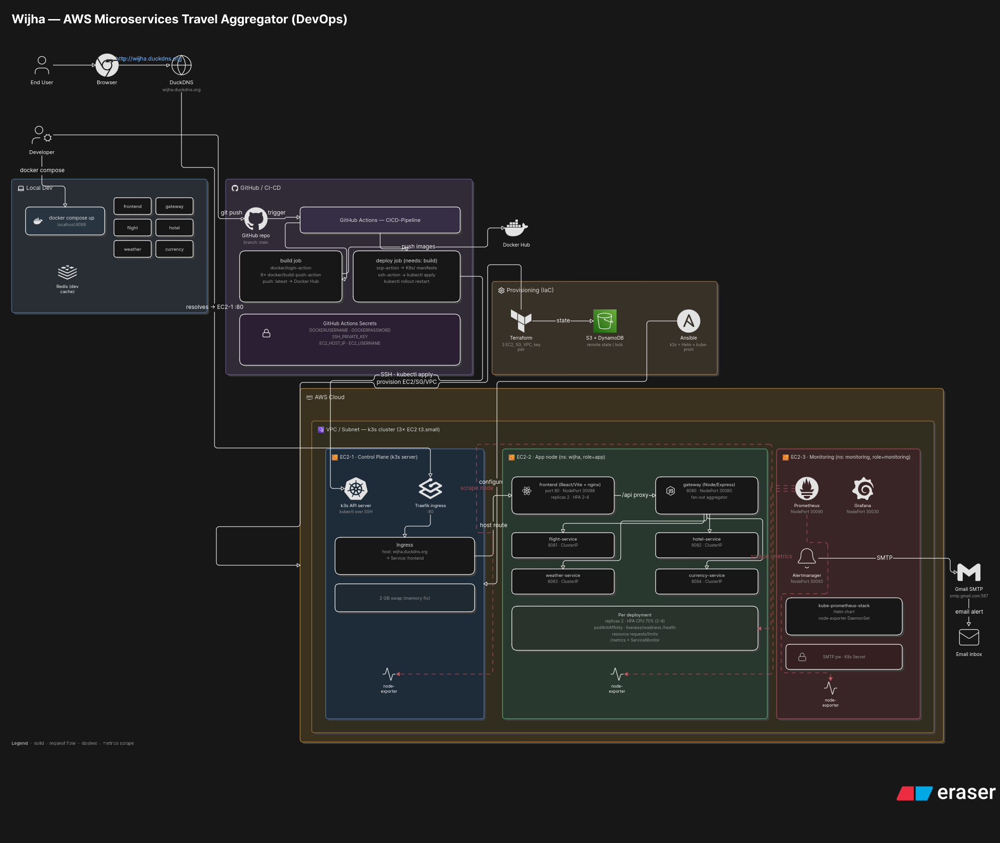

# Wijha — AWS Microservices Travel Aggregator

DEPI graduation project (DevOps track). Wijha ("destination") is a microservices
travel aggregator: one search returns **flights + hotels + weather** for a trip,
priced in a chosen currency. Services are stateless with mock data — **no
database by design**.

The application runs on a three-node **k3s** Kubernetes cluster on AWS EC2,
provisioned by **Terraform**, configured by **Ansible**, deployed by a **GitHub
Actions** pipeline, and observed by **Prometheus / Grafana / Alertmanager** with
email alerting.

## Architecture



- **GitHub Actions (CICD-Pipeline)**: build 6 Docker images, push to Docker Hub,
  then scp manifests to the cluster and `kubectl apply` + `rollout restart`.
- **AWS / k3s cluster** (3 EC2 nodes):
  - EC2-1 Control Plane — k3s API server, kubectl/Helm.
  - EC2-2 App node (namespace `wijha`) — frontend + gateway (NodePort) and four
    backends (ClusterIP), each `replicas: 2` with HPA and podAntiAffinity.
  - EC2-3 Monitoring — kube-prometheus-stack (Prometheus, Grafana, Alertmanager,
    node-exporter DaemonSet).
- **Alertmanager → Gmail SMTP** emails on failure.
- **Terraform + Ansible** provision and configure the whole stack.

## Live access

The app is served on a clean URL via a **Traefik Ingress on port 80** with a free
**DuckDNS** subdomain — no NodePort in the address. The other UIs still use
NodePort. A NodePort answers on **every** node's public IP, so the control-plane
server IP works for everything even when other node IPs change on stop/start.
Public IPs change when instances are restarted (repoint DuckDNS after a restart).

| What | URL |
|------|-----|
| **Application (frontend)** | **http://wijha.duckdns.org** |
| Application (NodePort, direct) | http://3.238.250.18:30088 |
| Gateway health | http://3.238.250.18:30080/health |
| Gateway API (example) | http://3.238.250.18:30080/api/search?from=CAI&to=DXB&toCity=Dubai&date=2026-07-01&checkout=2026-07-05&currency=EGP |
| Prometheus | http://3.238.250.18:30090 |
| Grafana (admin / admin) | http://3.238.250.18:30030 |
| Alertmanager | http://3.238.250.18:30093 |

Per-node public IPs (may be stale after a restart): server `3.238.250.18`,
app `3.236.171.218`, monitoring `3.238.198.185`. The app is also reachable via
the app node directly at `http://3.236.171.218:30088`.

SSH to the server: `ssh -i ~/.ssh/id_ed25519 ubuntu@3.238.250.18`

## Services

| Service | Port | k8s exposure | Endpoints |
|---------|------|--------------|-----------|
| `gateway` | 8080 | NodePort 30080 | `/api/search`, `/api/flights`, `/api/hotels`, `/api/weather`, `/api/convert`, `/health`, `/metrics` |
| `flight-service` | 8081 | ClusterIP | `/flights?from=&to=&date=`, `/health`, `/metrics` |
| `hotel-service` | 8082 | ClusterIP | `/hotels?city=&checkin=&checkout=`, `/health`, `/metrics` |
| `weather-service` | 8083 | ClusterIP | `/weather?city=`, `/health`, `/metrics` |
| `currency-service` | 8084 | ClusterIP | `/convert?from=&to=&amount=`, `/rates`, `/health`, `/metrics` |
| `frontend` | 80 | NodePort 30088 | static SPA + `/api` proxy to gateway |

Every backend exposes Prometheus metrics at `/metrics` and a liveness probe at
`/health`. Stack: **Node.js / Express**, **React / Vite**.

## Run it locally (Docker Compose)

```bash
docker compose up --build
# open http://localhost:8088
```

## Run a single service (no Docker)

```bash
cd services/flight-service && npm install && npm start
# http://localhost:8081/flights?from=CAI&to=DXB&date=2026-07-01
```

## DevOps stack

- **Terraform** (`infra/terraform/`): 3 EC2, security group, key pair; remote
  state in S3 with DynamoDB locking.
- **Ansible** (`infra/ansible/`): k3s server + agents, kube-prometheus-stack.
- **Kubernetes** (`Kubernetes/`): per-service Deployment + Service + HPA,
  podAntiAffinity, probes, ServiceMonitors for app metrics; `ingress.yaml`
  (Traefik) exposes the frontend on port 80 at the DuckDNS host.
- **CI/CD** (`.github/workflows/CICD-Pipeline.yml`): build/push 6 images, deploy
  over SSH.
- **Monitoring**: Prometheus scrapes `/metrics` (5 ServiceMonitors); Grafana app
  dashboard at `infra/monitoring/wijha-app-dashboard.json`; Alertmanager emails
  on pod/node/deployment failures.

### Gateway env vars

| Var | Default | Purpose |
|-----|---------|---------|
| `FLIGHT_URL` | `http://flight-service:8081` | flight-service base URL |
| `HOTEL_URL` | `http://hotel-service:8082` | hotel-service base URL |
| `WEATHER_URL` | `http://weather-service:8083` | weather-service base URL |
| `CURRENCY_URL` | `http://currency-service:8084` | currency-service base URL |
| `CACHE_TTL_SECONDS` | `60` | cache TTL |
